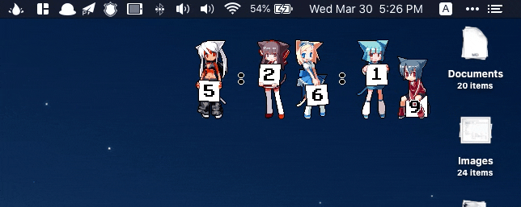

# aniclock

A clock with anime girls holding digits, useful for desktop widgets.

Basically it looks like this:

  

> Saw some black dots around straight lines? They are the artifacts of gif downscaling and will **not** be present in the actual image. However, I am not refering to the pixelated look of the image, which is intended.

## Features

- Double click hours to change styles (small or medium; static or animated).

- Double click minutes to show/hide seconds.

- Drag it to move around.

- Optimized to use the lowest possible resources

  > Although it barely uses any CPU with default settings (animated, showing seconds), if you want to lower CPU usage even further, use static (instead of animated) styles and hide seconds.

- Position on screen, style, and visibility of seconds are preserved between reloads

## Possible use case

### macOS desktop widget

I personally use it as a desktop widget with [Plash (available for macOS)](https://github.com/sindresorhus/Plash):

  

For Windows users, try applications like Wallpaper Engine.

---

>  Note: all the pictures of digits (except the colons) are from [gelbooru](https://gelbooru.com), [konachan](https://konachan.com), and [lolibooru](https://lolibooru.moe).

